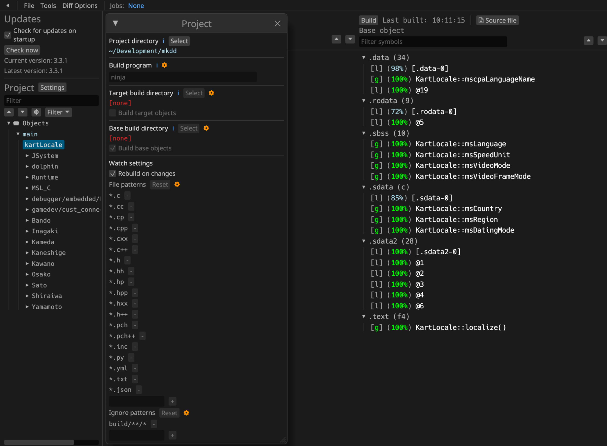

Mario Kart Double Dash!!  
[![Build Status]][actions] [![Code Progress]][progress] [![Data Progress]][progress] [![Discord Badge]][discord]
=============

[Build Status]: https://github.com/doldecomp/mkdd/actions/workflows/build.yml/badge.svg
[actions]: https://github.com/doldecomp/mkdd/actions/workflows/build.yml
[Code Progress]: https://decomp.dev/doldecomp/mkdd.svg?mode=shield&measure=code&label=Code
[Data Progress]: https://decomp.dev/doldecomp/mkdd.svg?mode=shield&measure=data&label=Data
[progress]: https://decomp.dev/doldecomp/mkdd
[Discord Badge]: https://img.shields.io/discord/727908905392275526?color=%237289DA&logo=discord&logoColor=%23FFFFFF
[discord]: https://discord.gg/hKx3FJJgrV

WIP 1:1 Decompilation of Mario Kart Double Dash!!

This repository does **not** contain any game assets or assembly whatsoever. An existing copy of the game is required.

Currently only the debug version is supported.

Dependencies
============

Windows
--------

On Windows, it's **highly recommended** to use native tooling. WSL or msys2 are **not** required.  
When running under WSL, [objdiff](#diffing) is unable to get filesystem notifications for automatic rebuilds.

- Install [Python](https://www.python.org/downloads/) and add it to `%PATH%`.
  - Also available from the [Windows Store](https://apps.microsoft.com/store/detail/python-311/9NRWMJP3717K).
- Download [ninja](https://github.com/ninja-build/ninja/releases) and add it to `%PATH%`.
  - Quick install via pip: `pip install ninja`

macOS
------

- Install [ninja](https://github.com/ninja-build/ninja/wiki/Pre-built-Ninja-packages):

  ```sh
  brew install ninja
  ```

- Install [wine-crossover](https://github.com/Gcenx/homebrew-wine):

  ```sh
  brew install --cask --no-quarantine gcenx/wine/wine-crossover
  ```

After OS upgrades, if macOS complains about `Wine Crossover.app` being unverified, you can unquarantine it using:

```sh
sudo xattr -rd com.apple.quarantine '/Applications/Wine Crossover.app'
```

Linux
------

- Install [ninja](https://github.com/ninja-build/ninja/wiki/Pre-built-Ninja-packages).
- For non-x86(_64) platforms: Install wine from your package manager.
  - For x86(_64), [wibo](https://github.com/decompals/wibo), a minimal 32-bit Windows binary wrapper, will be automatically downloaded and used.

Building
========

- Clone the repository:

  ```sh
  git clone https://github.com/doldecomp/mkdd.git
  ```

- Copy your game's disc image to `orig/MarioClub_us`.
  - Supported formats: ISO (GCM), RVZ, WIA, WBFS, CISO, NFS, GCZ, TGC
  - After the initial build, the disc image can be deleted to save space.

- Configure:

  ```sh
  python configure.py
  ```

  To use a version other than `MarioClub_us` (USA), specify it with `--version`.

- Build:

  ```sh
  ninja
  ```

Diffing
=======

Once the initial build succeeds, an `objdiff.json` should exist in the project root.

Download the latest release from [encounter/objdiff](https://github.com/encounter/objdiff). Under project settings, set `Project directory`. The configuration should be loaded automatically.

Select an object from the left sidebar to begin diffing. Changes to the project will rebuild automatically: changes to source files, headers, `configure.py`, `splits.txt` or `symbols.txt`.



## Credits
- [SwareJonge](https://github.com/SwareJonge) for originally starting this project, and for guiding many people in their first contributions towards a decomp.
- [Seeky](https://github.com/SeekyCt) for ppcdis, without it this project wouldn't have been where it is now.
- [encounter](https://github.com/encounter) for their amazing tools (decomp-toolkit, ObjDiff, et al.) which have so helped not only this project, but the entire decomp community.
### Matching
Used code from the following repositories(JSystem, SDK)
* [Metroid Prime Decomp](https://github.com/PrimeDecomp/prime)
* [Pikmin 2 Decomp](https://github.com/projectPiki/pikmin2)
* [Super Mario Galaxy Decomp](https://github.com/shibbo/Petari)
* [Super Mario Sunshine Decomp](https://github.com/doldecomp/sms)
* [Syati](https://github.com/PMArkive/Syati-pretransfer)
* [Twilight Princess Decomp](https://github.com/zeldaret/tp)

And many thanks to the people who helped me match some game functions (sorry if anyone is forgotten.)
* [Chippy](https://github.com/1superchip)
* [kiwi](https://github.com/kiwi515)
* [Seeky](https://github.com/SeekyCt)
